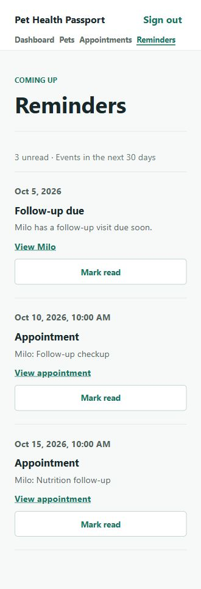
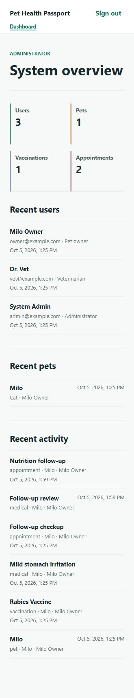

# Pet Health Passport: Final Project Report

## 1. Project summary

Pet Health Passport is a full-stack web application that keeps a pet's profile and health history in one place. An owner can record vaccinations, medical visits, allergies, medications, weights, and documents, then manage appointments and view upcoming reminders. The project also demonstrates a Docker Compose deployment and a Jenkins pipeline.

## 2. Problem and objectives

Pet health information often lives in paper records, photos, messages, and separate clinic files. This makes it difficult to find the right information during a visit or remember a future care date. The application gives each pet a structured record and shows upcoming care in the owner's dashboard.

The delivered objectives are:

1. Authenticate users and restrict routes by role.
2. Let owners manage their own pets and health records.
3. Show appointments and reminders derived from care dates.
4. Give owners and admins separate dashboards.
5. Build, test, and deploy the application through Jenkins and Docker Compose.

## 3. Scope and users

| Role | Delivered behavior |
| --- | --- |
| Owner | Register, sign in, manage own pets and records, schedule visits, read reminders, view dashboard |
| Vet | View shared pet passports and add medical visits |
| Admin | Sign in and view system statistics and recent activity |

Admin user management, public shareable passports, and QR codes remain outside the delivered application.

## 4. System design

```text
Browser -> React/Vite (Nginx in Docker) -> Express REST API -> PostgreSQL
                                               |
                                               +-> local document storage volume
```

The frontend stores the JWT in browser session storage and sends it as a bearer token. The backend checks the token and role before protected routes. Owner queries are scoped to the authenticated owner's pets. PostgreSQL holds users, pets, health records, appointments, and reminder read state. Uploaded documents are kept in a Docker volume.

The database contains `users`, `pets`, `vaccination_records`, `medical_records`, `allergy_records`, `medication_records`, `appointments`, `weight_records`, `documents`, and `reminders`. Reminders shown in the application are derived from upcoming appointments, vaccine due dates, medication end dates, and medical follow-up dates. The `reminders` table stores read state for those events.

## 5. Implemented features

- Registration, login, logout, JWT authentication, and role checks.
- Pet profile creation, listing, detail, editing, and deletion for the owner.
- Vaccination, medical, allergy, medication, and weight record management.
- PDF, PNG, and JPEG document upload and authenticated download.
- Appointment creation, editing, status changes, and deletion.
- In-app reminders for events in the next 30 days, with read state.
- Owner dashboard with counts, upcoming care, recent records, and weight chart.
- Admin dashboard with counts, recent users and pets, and recent activity.
- Owner-controlled veterinarian access for individual pets, with shared history and vet-authored medical visits.
- Docker Compose services for PostgreSQL, API, and frontend; Jenkins pipeline for checkout, dependency installation, tests, build, deployment, and health check.

## 6. Verification

On 5 October 2026, the local demo flow was exercised in the browser:

| Step | Observed result |
| --- | --- |
| Owner sign-in | Opened owner dashboard with Milo and upcoming care |
| Pet profile | Milo's details and existing health records loaded |
| Add medical visit | A new 5 October follow-up review appeared in medical visits |
| Create appointment | A 15 October nutrition follow-up appeared in upcoming appointments |
| Reminders | The new appointment appeared as an unread reminder |
| Admin sign-in | Dashboard showed 3 users, 1 pet, 1 vaccination, 2 appointments, and the new activity |
| Vet access (5 October 2026) | Owner shared Milo, vet read records and added a visit, owner saw the visit, and revocation blocked further access. The test visit was removed afterward. |

Jenkins job `pet-health-passport` build #1 completed successfully, including backend tests, frontend build, Docker build and deployment, and health check. The pipeline result is available locally at `http://localhost:8080/job/pet-health-passport/1/` while Jenkins is running.

Browser evidence from the local demo:





The new demo records live in the current local PostgreSQL volume. A fresh volume is initialized from `database/seed.sql`, which now uses dates relative to initialization so the appointment and follow-up reminders remain demonstrable later. The schema and seed were also run in a rolled-back PostgreSQL transaction: they created 3 users, 1 pet, 1 upcoming appointment, and 1 upcoming follow-up without changing the live database.

## 7. Limitations and future work

- The GitHub webhook is configured in the pipeline but cannot receive GitHub events until Jenkins has a public HTTPS URL and the repository webhook is created.
- Vets can add medical visits for shared pets, but cannot edit or delete existing records. Admin user management is not implemented.
- Reminders are shown in the app; email, push, and LINE delivery are not implemented.
- Document files use local Docker storage, so a production deployment would need backup and storage planning.
- The seed is intended for a classroom demo, not production data. Demo passwords must not be used for a public deployment.

## 8. Conclusion

The owner journey from pet record to appointment and reminder works end to end, and an admin can monitor the resulting activity. Owners can also grant a vet access to a pet's passport and remove it later. Docker Compose and Jenkins provide a repeatable local build and deployment path. Remaining work includes external integration and expanded admin permissions.
